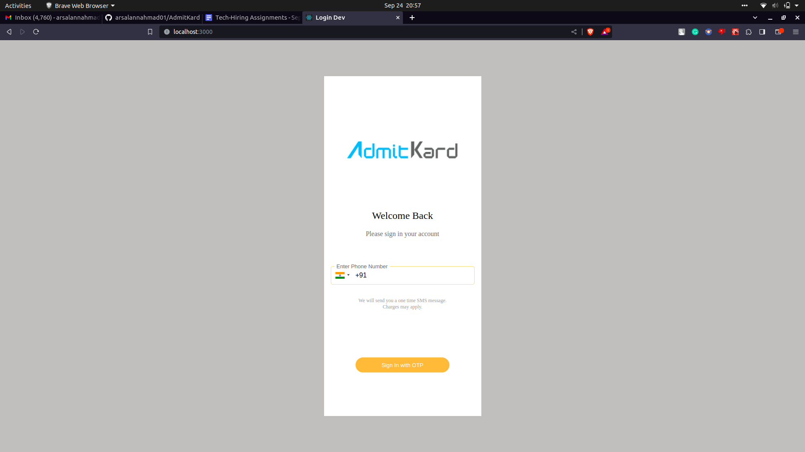
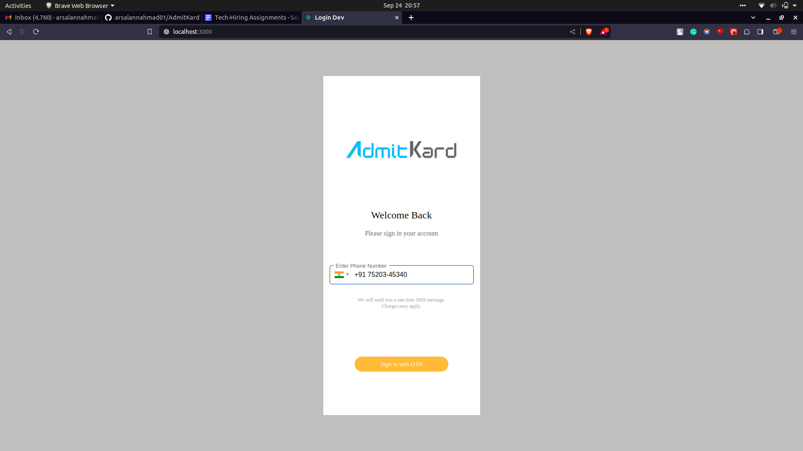
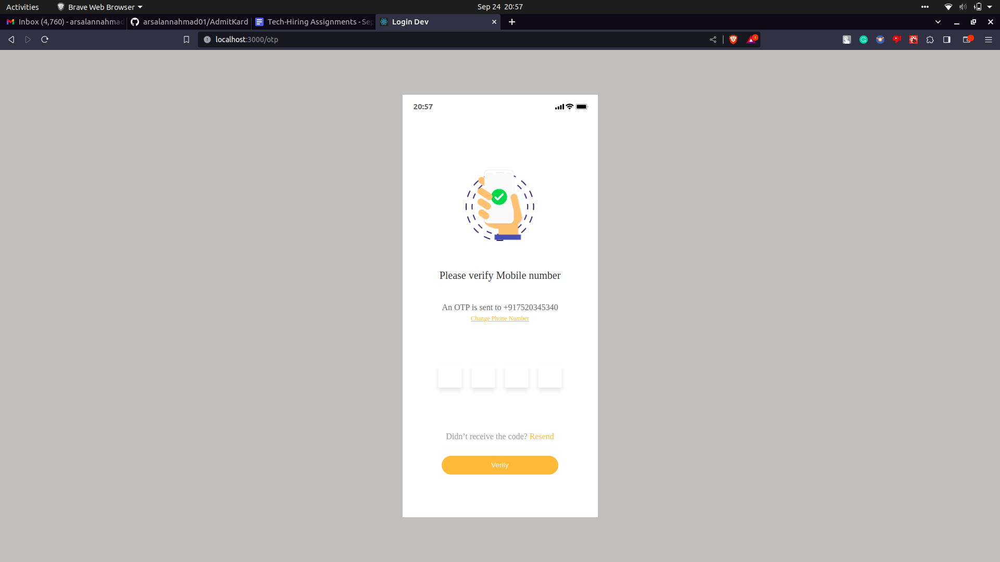
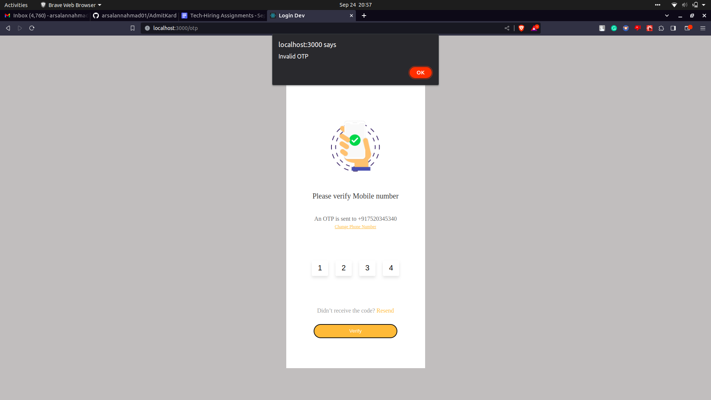
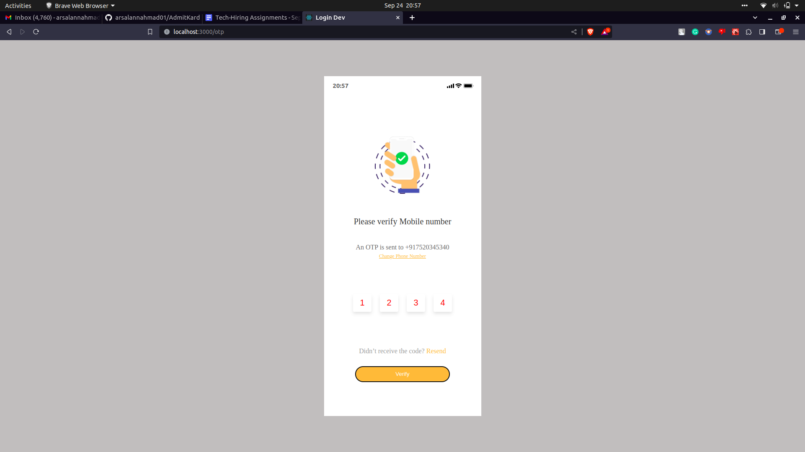
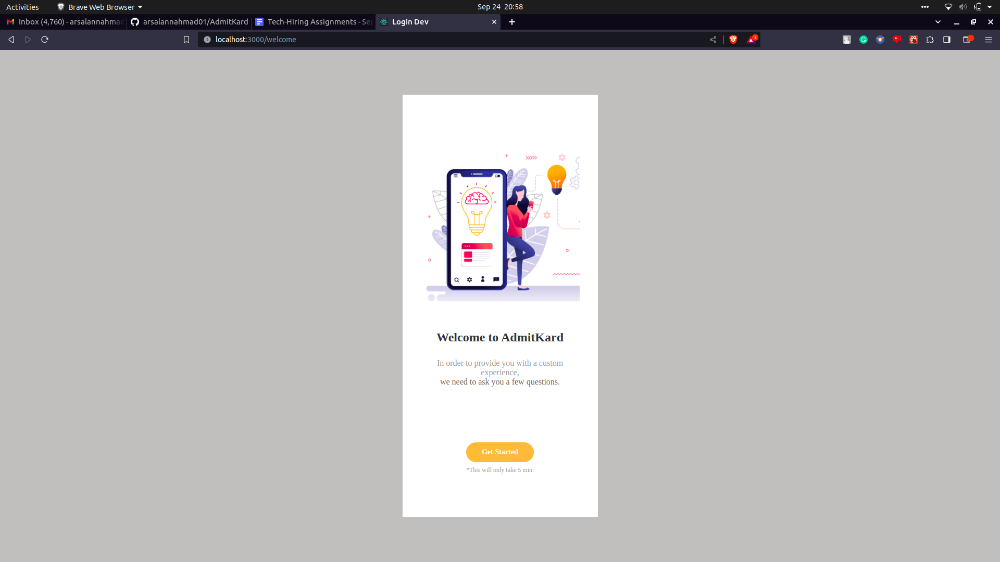

# Client Setup

1. **Install NPM Packages**
   - Open your terminal/command prompt.
   - Navigate to the client directory.
   - Run the following command to install NPM packages:

     ```
     npm install
     ```

2. **Run the React Client**
   - After the packages are installed, run the client using:

     ```
     npm start
     ```

# Server Setup

1. **Install NPM Packages**
   - Open your terminal/command prompt.
   - Navigate to the server directory.
   - Run the following command to install NPM packages:

     ```
     npm install
     ```

2. **Run the Node Server**
   - After the packages are installed, start the server with:

     ```
     npm start
     ```

Please make sure you have Node.js and NPM (Node Package Manager) installed on your system.







